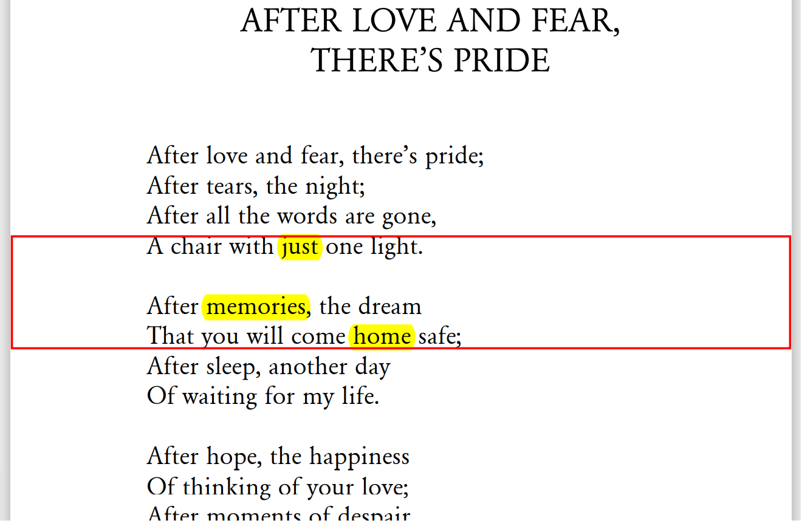

# Combo-Word-Search
Finds the best spot in a PDF where the search words are closest to each other.
## Example
By searching for ["just", "Memories", "HOME"] the algorithm marks this area in 
the Sample-PDF

